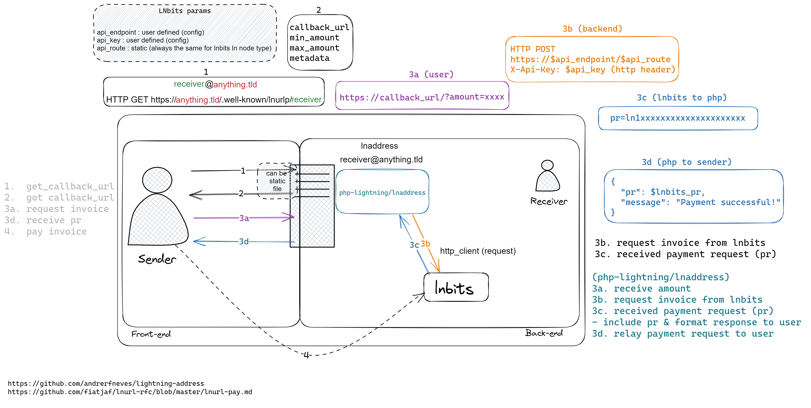

# PHP Lightning Address

PHP Lightning Address is an easy way to get a [lightning address](https://lightningaddress.com/) in PHP.

<p align="center">
  <a href="https://github.com/php-lightning/lnaddress/actions">
    
  </a>
  <a href="https://scrutinizer-ci.com/g/php-lightning/lnaddress/?branch=main">
    
  </a>
  <a href="https://scrutinizer-ci.com/g/php-lightning/lnaddress/?branch=main">
    
  </a>
  <a href="https://shepherd.dev/github/php-lightning/lnaddress">
    
  </a>
  <a href="https://github.com/php-lightning/lnaddress/blob/master/LICENSE">
    
  </a>
</p>

## Table of contents

- [Prerequisite](#prerequisite)
- [Supported Lightning implementation](#supported-lightning-implementation)
- [Prerequisite web server configuration](#prerequisite-web-server-configuration)
    * [Configure web server to rewrite URL](#configure-web-server-to-rewrite-url)
        + [Nginx](#nginx)
        + [Apache](#apache)
    * [Without rewriting URL](#without-rewriting-url)
- [Usage](#usage)
    * [Rename & move the script to the right directory](#rename--move-the-script-to-the-right-directory)
    * [Set API endpoint & API Key](#set-api-endpoint--api-key)
    * [Customization](#customization)
    * [To add a new address](#to-add-a-new-address)
- [Contributions](#contributions)

## Prerequisite

- [x] Web server with PHP backend
- [x] LNbits Lightning implementation backend
- Please note that **LNbits doesn't need to be on the same server**
- *You can use https://legend.lnbits.com/ for testing purpose*
- [x] Web server **must** be able to be configured
    - [x] to rewrite URL requests
    - _**OR**_
    - [x] to let the PHP backend handle specific file(s) that don't have a `.php` extension

## Supported Lightning implementation

- [LNbits](https://github.com/lnbits/lnbits)

More Lightning implementation will be supported in the future.

## Lightning Address flowchart



# Prerequisite web server configuration

## Configure web server to rewrite URL

### Nginx

Nginx configuration

```
location /.well-known/lnurlp {
    rewrite ^/.well-known/lnurlp/(.*)$ /.well-known/lnurlp/$1.php last;
}
```

### Apache

Apache configuration

You need to put a `.htaccess` file in the `.well-known/lnurlp/` of your web root directory with the following content

```
RewriteEngine On
RewriteCond %{REQUEST_FILENAME} !-d
RewriteCond %{REQUEST_FILENAME} !-f
RewriteCond %{REQUEST_FILENAME}.php -f
RewriteRule (.*) $1.php [L]
```

Please note that `.htaccess` file will not be read if the Apache configuration doesn't allow configuration overriding, please see Apache documentation regarding `AllowOverride` directive.

## Without rewriting URL

You might be able to configure your web server to let the PHP backend handle specific files, in that way the script can be named without `.php` extension and URL rewriting is thus not needed.

## Usage

> TL;DR: Video demo (~1 min): https://youtu.be/7HaTf5cknxM

### Rename & move the script to the right directory

Once the web server is configured to rewrite url requests `.well-known/lnurlp/anything` to `.well-known/lnurlp/anything.php`, the `index.php` (inside `public/`) script needs to be renamed with the wanted username part of the [lightning address](https://lightningaddress.com/), such as for a wanted ln address `ben@anything.dne`, the script must be named `ben.php`.

Then, the script needs to be in the subdirectory `.well-known/lnurlp/` of your web root directory of your web server such as https://www.yourwebsite.dne/.well-known/lnurlp/ points to your `$WEBROOT/.well-known/lnurlp/` directory.

### Set API endpoint & API Key

The following need to be changed according to your `apiEndpoint` and `apiKey` that your LNbits wallet provides, be sure to use the **invoice/read key**.

```php
# lightning-config.php
return (new LightningConfig())
    ->setDomain('your-domain.com')
    ->setReceiver('custom-receiver')
    ->setSendableRange(min: 100_000, max: 10_000_000_000)
    ->addBackend(
        (new LnBitsBackendConfig())
            ->setApiEndpoint('http://localhost:5000') // lnbits endpoint : protocol://host:port
            ->setApiKey('3h9e75cf...9eca373'),        // put your lnbits read key here
    );
```

> **Please note that the `min` and `max` do not reflect the actual min/max sendable amount, it depends on the capacity
of your LN backend**

## To add a new address

To add a new [lightning address](https://lightningaddress.com/), the only thing needed is copying and pasting the script, **don't forget to change the API Key if you want the funds to be received on another wallet**, and name the file with the user part of the [lightning address](https://lightningaddress.com/) wanted.

## Demo template

Check the **demo template**: [https://github.com/php-lightning/demo-lnaddress](https://github.com/php-lightning/demo-lnaddress)

## Contributions

Feel free to open issues & PR if you want to contribute to this project.
