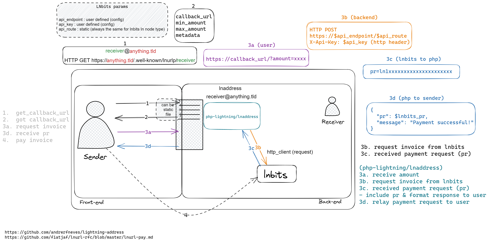

# Architecture

A small [Gacela](https://gacela-project.com) modular monolith: every module exposes a
**Facade**, builds its objects in a **Factory**, reads settings through a **Config**, and
declares external dependencies in a **Provider**. Nothing outside a module touches its
internals.



## Request flow

```
public/index.php
  └─ Gacela::bootstrap()               gacela.php: app config, router, plugins
  └─ Router::run()
       └─ InvoiceRoutesPlugin          GET|OPTIONS {username?}
            ├─ CorsMiddleware          CORS headers; short-circuits OPTIONS
            ├─ InvoiceExceptionHandler any Throwable → LNURL error object
            └─ InvoiceController       reads ?amount
                 └─ InvoiceFacade
                      ├─ getCallbackUrl($username)          amount == 0
                      │    └─ Application\CallbackUrl            → pay params
                      └─ generateInvoice($username, $msat)
                           └─ Application\InvoiceGenerator
                                └─ Domain\BackendInvoice\LnbitsBackendInvoice
                                     └─ Infrastructure\Http\HttpApi (Symfony HttpClient)
```

## Module layout

```
src/
├── Invoice/                             the feature module
│   ├── InvoiceFacade.php                public API   @extends AbstractFacade<InvoiceFactory>
│   ├── InvoiceFactory.php               wiring       @extends AbstractFactory<InvoiceConfig>
│   ├── InvoiceConfig.php                typed config reads + per-user backend lookup
│   ├── InvoiceDependencyProvider.php    external deps (HTTP_API)
│   ├── Application/                     CallbackUrl, InvoiceGenerator
│   ├── Domain/                          BackendInvoice, CallbackUrl, Http — interfaces + logic
│   └── Infrastructure/                  Controller, Handler, Middleware, Http, Plugin
├── Config/                              LightningConfig, BackendsConfig, BackendType, LnBitsBackendConfig
└── Shared/                              Config\ConfigKey, Transfer\*, Value\SendableRange, Value\LnurlPayMetadata
```

**Layer rules**

- `Application` orchestrates and depends on `Domain` interfaces only.
- `Domain` is pure: no HTTP, no framework, no config lookups — collaborators arrive as
  constructor arguments (`HttpApiInterface`, `BackendInvoiceInterface`,
  `LnAddressGeneratorInterface`).
- `Infrastructure` holds everything that talks to the outside world.
- `Shared` carries data across modules: `Transfer` suffix for DTOs, value objects for
  invariants (`SendableRange`, `LnurlPayMetadata`).

**Gacela specifics**

- The abstract classes are templated: annotate with `@extends AbstractFacade<InvoiceFactory>`
  and `@extends AbstractFactory<InvoiceConfig>`.
- `InvoiceController` resolves its facade through `ServiceResolverAwareTrait` plus the
  `@method InvoiceFacade getFacade()` docblock (`DocBlockResolverAwareTrait` is deprecated).
- `InvoiceDependencyProvider` registers `HTTP_API`; that seam is how the Symfony-backed
  `HttpApi` reaches the domain, and how feature tests swap in `FakeHttpApi`.

## Key objects

| Class | Responsibility |
|---|---|
| `Application\CallbackUrl` | Builds the LUD-06 pay params (`callback`, min/max sendable, metadata) |
| `Application\InvoiceGenerator` | Validates the amount, converts msat → sat, maps `InvoiceTransfer` to the response |
| `Domain\CallbackUrl\LnAddressGenerator` | Resolves `username@domain`, falling back to the configured receiver |
| `Domain\BackendInvoice\LnbitsBackendInvoice` | `POST {api_endpoint}/api/v1/payments` with `X-Api-Key`, `description_hash`, `unhashed_description` |
| `Domain\BackendInvoice\EmptyBackendInvoice` | Null object for users without a usable backend |
| `Infrastructure\Middleware\CorsMiddleware` | `Access-Control-Allow-Origin: *`; answers `OPTIONS` preflight |
| `Infrastructure\Handler\InvoiceExceptionHandler` | Turns any `Throwable` into `{status: ERROR, reason: …}` |
| `Shared\Value\SendableRange` | Min/max msat bounds and `contains()` |
| `Shared\Value\LnurlPayMetadata` | LUD-06 metadata, JSON-encoded so quotes stay safe |
| `Shared\Config\ConfigKey` | The config key strings, shared by writer and reader |

## Adding a backend

`LnbitsBackendInvoice` is one implementation of `BackendInvoiceInterface`:

1. Add a case to `PhpLightning\Config\Backend\BackendType`.
2. Handle it in `LightningConfig::createBackendConfig()` with a
   `BackendConfigInterface` implementation.
3. Implement `BackendInvoiceInterface` under `Invoice/Domain/BackendInvoice/`.
4. Select it in `InvoiceFactory::getBackendForUser()`.

The Application layer stays untouched — it only knows the interface.

## Not implemented

Marked as TODO in the code: LNURL comments (`commentAllowed` is always `false`) and image
metadata in the pay params.
